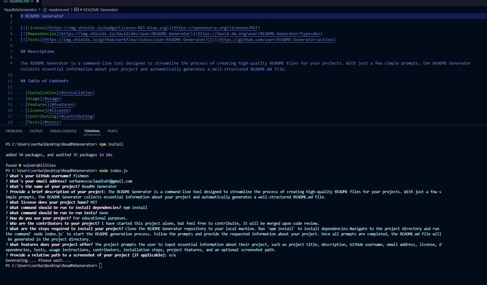

# README Generator

## Description

The README Generator is a command-line tool designed to streamline the process of creating high-quality README files for your projects. With just a few simple prompts, the README Generator collects essential information about your project and automatically generates a well-structured README.md file.

## Table of Contents

- [Installation](#installation)
- [Usage](#usage)
- [Features](#features)
- [License](#license)
- [Contributing](#contributing)
- [Tests](#tests)
- [Questions](#questions)
- [Screenshot](#screenshot)

## Installation

To install the README Generator, follow these steps:

1. Clone the repository to your local machine:

`git@github.com:fishmon/ReadMeGenerator.git`

2. Navigate to the project directory:

`cd README-Generator`

3. Install dependencies:

`npm install`

## Usage

To use the README Generator, follow these steps:

1. Run the generator script:

`node index.js`

2. Follow the prompts and provide information about your project as requested.

3. Once all prompts are completed, the README.md file will be generated in the project directory.

## Demonstration video
 [Demo](https://drive.google.com/file/d/1kcbOTWFWuVFzI9qptlNUbQC39lo3Kfub/view?usp=drive_link)

## Features

- Prompt-based interface for collecting project details.
- Dynamic generation of a well-structured README.md file.
- Table of contents with anchor links for quick navigation.
- Support for various licenses and customizable installation and test commands.
- Feedback during the generation process, indicating progress and completion.
- Inclusion of license details in the generated README.

## License

This project is licensed under the [MIT](https://opensource.org/licenses/MIT) license.

## Contributing

Contributions to the README Generator project are welcome! To contribute, please follow these steps:

1. Fork the repository.
2. Create a new branch (`git checkout -b feature/new-feature`).
3. Make your changes.
4. Commit your changes (`git commit -m 'Add new feature'`).
5. Push to the branch (`git push origin feature/new-feature`).
6. Create a new Pull Request.

## Tests

To run tests, use the following command:
`npm test`

## Questions

If you have any questions about the project, feel free to reach out:

- GitHub: [Fishmon](https://github.com/fishmon)
- Email: serbanescuclaudiu93@gmail.com

## Screenshot

